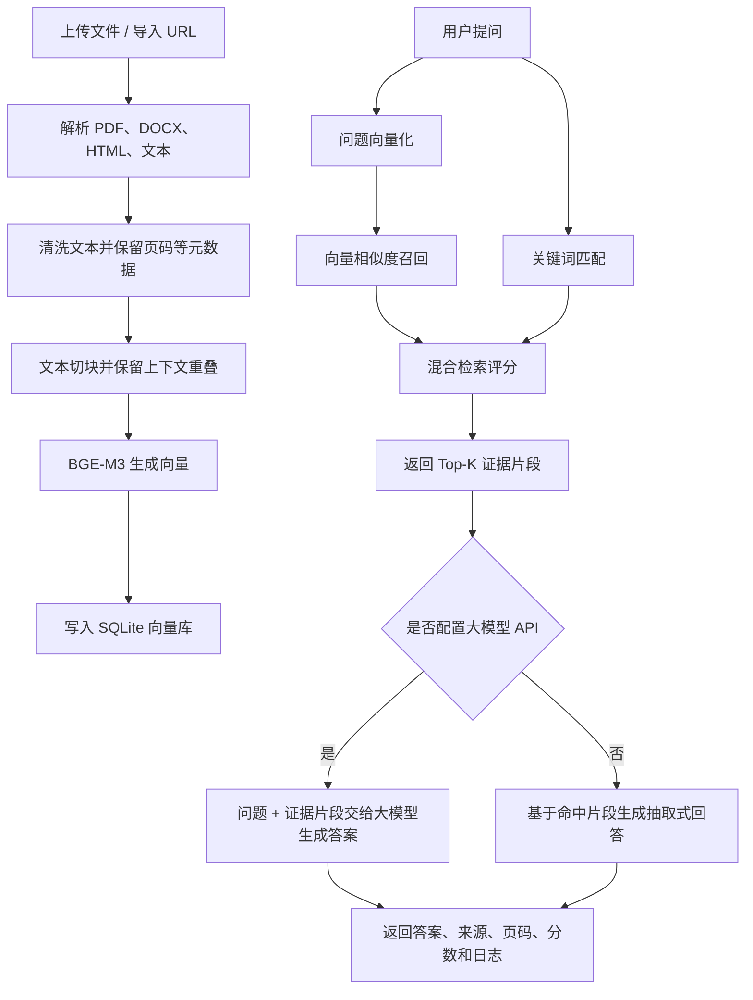

# 金融知识问答助手


一个面向金融资料的本地 RAG 知识库问答系统。

项目支持 PDF、Word、HTML、Markdown、TXT 和公开 URL 入库，使用本地 BGE-M3 嵌入模型完成向量化，将文档、分块、向量和问答日志持久化到 SQLite。前端提供资料入库、知识库管理、检索问答和 RAG 流程追踪等生产控制台式页面。

> 本项目适合用于金融资料检索、RAG 工程实践、求职项目展示和本地知识库原型验证。

## 目录

- [核心功能](#核心功能)
- [技术栈](#技术栈)
- [项目结构](#项目结构)
- [RAG 工作流程](#rag-工作流程)
- [快速开始](#快速开始)
- [嵌入模型说明](#嵌入模型说明)
- [配置说明](#配置说明)
- [运行方式](#运行方式)
- [PyCharm 运行](#pycharm-运行)
- [核心接口](#核心接口)
- [数据存储](#数据存储)
- [上传 GitHub 时应保留的文件](#上传-github-时应保留的文件)
- [后续规划](#后续规划)
- [免责声明](#免责声明)

## 核心功能

- **多格式资料入库**：支持 `.pdf`、`.docx`、`.txt`、`.md`、`.html`、`.htm`。
- **URL 导入**：支持从公开网页或 PDF URL 导入资料。
- **本地向量化**：使用本地 BGE-M3 模型生成文本向量。
- **SQLite 向量库**：持久化文档、分块、向量、问答日志和检索指标。
- **异步入库任务**：上传后可查看解析、切块、向量化和写入状态。
- **知识库管理**：支持查看文档分块、删除资料、重建索引。
- **混合检索**：结合向量相似度和关键词匹配，返回向量分、文本分和综合分。
- **大模型回答**：支持 DeepSeek 等兼容 OpenAI Chat Completions 格式的大模型 API。
- **证据引用**：回答时返回参考来源、页码、chunk 编号和命中分数。
- **RAG 可视化**：前端展示资料入库、检索召回、回答生成和流程追踪。

## 技术栈

| 模块       | 技术                                   |
| ---------- | -------------------------------------- |
| 后端服务   | FastAPI、Pydantic、Uvicorn             |
| 文档解析   | pypdf、python-docx、BeautifulSoup      |
| 向量模型   | BGE-M3、sentence-transformers          |
| 检索计算   | NumPy、scikit-learn                    |
| 向量存储   | SQLite                                 |
| 前端       | HTML、CSS、JavaScript                  |
| 大模型接口 | OpenAI-compatible Chat Completions API |

## 项目结构

```text
finance-rag-assistant/
├── app/
│   ├── public/              # 前端页面与静态资源
│   ├── config.py            # 环境变量和系统配置
│   ├── document_loader.py   # 文档解析与文本切块
│   ├── embedding.py         # BGE-M3 模型加载与向量化
│   ├── llm.py               # 大模型受约束生成
│   ├── main.py              # FastAPI 接口入口
│   ├── rag.py               # RAG 编排逻辑
│   ├── schemas.py           # 请求与响应结构
│   └── vector_store.py      # SQLite 向量库
├── data/
│   └── seed_sources.json    # 示例公开资料入口
├── scripts/
│   └── ingest_seed_sources.py
├── .env.example             # 环境变量模板
├── .gitignore
├── Dockerfile
├── docker-compose.yml
├── requirements.txt
└── README.md
```

## RAG 工作流程



## 快速开始

### 1. 克隆项目

```bash
git clone https://github.com/your-username/finance-rag-assistant1.git
cd finance-rag-assistant1
```

### 2. 创建虚拟环境

```bash
python -m venv .venv
```

Windows：

```powershell
.\.venv\Scripts\activate
```

macOS / Linux：

```bash
source .venv/bin/activate
```

### 3. 安装依赖

```bash
pip install --upgrade pip
pip install -r requirements.txt
```

### 4. 准备本地嵌入模型

本项目默认使用 **BGE-M3** 作为本地嵌入模型。模型文件体积较大，**不会随仓库一起上传**，需要使用者自行下载并放到本地目录。

下载或准备好模型后，在 `.env` 中配置：

```env
EMBEDDING_MODEL_PATH=D:\your-path\bge-m3
```

路径需要指向包含模型文件的目录，例如该目录下通常会有 `config.json`、`tokenizer.json`、模型权重文件等。

### 5. 创建配置文件

```bash
cp .env.example .env
```

Windows PowerShell：

```powershell
Copy-Item .env.example .env
```

### 6. 启动服务

```bash
uvicorn app.main:app --reload --host 127.0.0.1 --port 8000
```

浏览器打开：

```text
http://127.0.0.1:8000
```

## 嵌入模型说明

仓库中不包含 BGE-M3 模型文件。

原因：

- 模型文件体积较大，不适合直接提交到 GitHub。
- 不同用户的模型存放路径不同，应通过 `.env` 配置。
- 这样可以避免仓库过大，也更符合真实项目的部署方式。

你需要自行准备 BGE-M3 模型，并在 `.env` 中设置：

```env
EMBEDDING_MODEL_PATH=/absolute/path/to/bge-m3
```

Windows 示例：

```env
EMBEDDING_MODEL_PATH=D:\models\bge-m3
```

Linux / macOS 示例：

```env
EMBEDDING_MODEL_PATH=/home/user/models/bge-m3
```

如果路径配置错误，入库或问答时会在加载嵌入模型阶段失败。

## 配置说明

编辑 `.env`：

```env
APP_NAME=金融知识问答助手
DATA_DIR=./storage
VECTOR_DB_PATH=./storage/vector_store.sqlite3

TOP_K=5
MIN_SCORE=0.35

EMBEDDING_MODEL_PATH=D:\your-path\bge-m3
EMBEDDING_DEVICE=cpu
EMBEDDING_BATCH_SIZE=8
QUERY_INSTRUCTION=Represent this sentence for searching relevant passages:

LLM_BASE_URL=https://api.deepseek.com
LLM_API_KEY=
LLM_MODEL=deepseek-chat
```

说明：

- `EMBEDDING_MODEL_PATH` 必须改成你本地 BGE-M3 模型路径，模型本身不包含在仓库中。
- `LLM_API_KEY` 为空时，系统会使用基于证据片段的抽取式回答。
- 如果接入 DeepSeek 或其他兼容 OpenAI 格式的大模型服务，需要填写 `LLM_BASE_URL`、`LLM_API_KEY` 和 `LLM_MODEL`。
- 不要把真实 `.env` 文件提交到 GitHub。

## 运行方式

### 命令行运行

```bash
uvicorn app.main:app --reload --host 127.0.0.1 --port 8000
```

### Docker 运行

如果你希望使用 Docker，可以根据项目中的 `Dockerfile` 和 `docker-compose.yml` 自行构建运行：

```bash
docker compose up --build
```

> 注意：Docker 方式仍然需要正确配置模型路径和环境变量。

## PyCharm 运行

项目下载到本地后，可以直接用 PyCharm 打开并运行。

1. 打开 PyCharm。
2. 选择 `File -> Open`，打开项目根目录。
3. 进入 `Settings -> Project -> Python Interpreter`。
4. 选择 `.venv` 解释器：
   - Windows：`.venv\Scripts\python.exe`
   - macOS / Linux：`.venv/bin/python`
5. 在 PyCharm Terminal 中安装依赖：

```bash
pip install -r requirements.txt
```

1. 复制 `.env.example` 为 `.env`，并修改 `EMBEDDING_MODEL_PATH` 和可选的大模型配置。
2. 新建运行配置：
   - 类型：`Python`
   - Module name：`uvicorn`
   - Parameters：`app.main:app --reload --host 127.0.0.1 --port 8000`
   - Working directory：项目根目录
3. 点击 Run，访问 `http://127.0.0.1:8000`。

## 核心接口

| 请求方法 | 接口路径                               | 说明                         |
| -------- | -------------------------------------- | ---------------------------- |
| `GET`    | `/`                                    | 前端页面                     |
| `GET`    | `/api/status`                          | 获取知识库、向量库和模型状态 |
| `POST`   | `/api/upload`                          | 上传本地文档并异步入库       |
| `POST`   | `/api/ingest-url`                      | 从公开 URL 导入资料          |
| `GET`    | `/api/tasks/{task_id}`                 | 获取异步入库任务状态         |
| `POST`   | `/api/ask`                             | 发起 RAG 问答                |
| `GET`    | `/api/history`                         | 获取问答历史                 |
| `GET`    | `/api/documents/{document_id}/chunks`  | 获取文档分块                 |
| `POST`   | `/api/documents/{document_id}/rebuild` | 重建文档索引                 |
| `DELETE` | `/api/documents/{document_id}`         | 删除文档及其向量             |
| `GET`    | `/documents/{document_id}/chunks`      | 文档分块可视化页面           |

## 数据存储

默认向量数据库路径：

```text
storage/vector_store.sqlite3
```

其中包含：

- 文档元数据
- 文本分块
- 嵌入向量
- 问答日志
- 检索来源
- 检索指标

`storage/` 是本地运行数据目录，不建议提交到 GitHub。

## 上传 GitHub 时应保留的文件

建议上传：

```text
app/
data/
scripts/
requirements.txt
README.md
.env.example
.gitignore
Dockerfile
docker-compose.yml
```

不要上传：

```text
.env
.venv/
storage/
source/
__pycache__/
*.pyc
app/__pycache__/
scripts/__pycache__/
```

原因：

- `.env` 可能包含 API Key，不应公开。
- `.venv/` 是本地虚拟环境，体积大且不可移植。
- `storage/` 是本地向量库和问答日志。
- `source/` 通常是本地下载的资料文件，体积可能很大，也可能不适合公开。
- BGE-M3 等本地模型目录体积较大，不应提交到 GitHub，应由使用者自行下载并配置路径。
- `__pycache__/` 和 `*.pyc` 是 Python 缓存文件。

## 后续规划

- 替换 SQLite 为 Qdrant、Milvus、pgvector 或 Elasticsearch。
- 增加 cross-encoder reranker，提高复杂问题排序质量。
- 增加用户登录、角色权限和多知识库隔离。
- 将入库任务拆分为 Celery / RQ 后台任务。
- 增加自动化测试和 CI。
- 增加生产级日志、监控和异常追踪。

## 免责声明

本项目用于金融资料检索、知识库问答和工程实践展示，不构成投资建议。涉及金融、法律、合规或投资决策时，请以官方资料为准，并咨询具备资质的专业人士。
