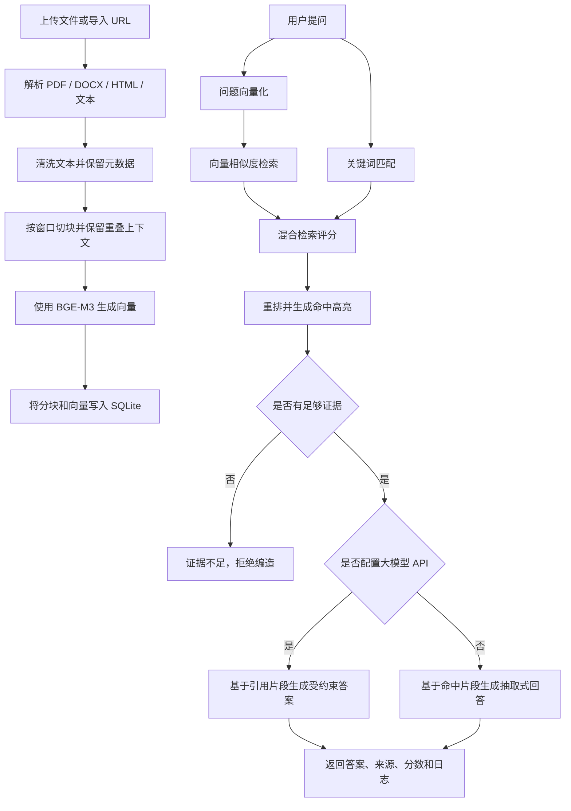

# 金融知识问答助手

一个面向金融资料的本地 RAG 知识库问答系统。

项目支持 PDF、Word、HTML、Markdown、TXT 和公开 URL 入库，使用本地 BGE-M3 嵌入模型完成文档向量化，并将文档、分块、向量和问答日志持久化到 SQLite。前端提供 RAG 全流程可视化，可展示资料解析、文本切块、向量入库、混合检索、命中高亮和答案来源。

## 功能特性

- 支持 PDF、Word、HTML、Markdown、TXT 等多格式资料入库
- 支持公开 URL 导入
- 使用本地 BGE-M3 模型生成文本向量
- 使用 SQLite 存储文档、分块、向量和问答日志
- 支持异步入库任务和进度展示
- 支持查看文档分块内容
- 支持删除文档和重建索引
- 支持向量检索 + 关键词匹配的混合检索
- 支持检索命中高亮、来源引用和相似度分数展示
- 支持 DeepSeek 等兼容 OpenAI 接口格式的大模型 API
- 未配置大模型 API 时，可使用基于证据片段的抽取式回答
- 前端展示完整 RAG 流程，包括解析、切块、向量化、入库、检索和回答生成

## 技术栈

- 后端：FastAPI、Pydantic、Uvicorn
- RAG：BGE-M3、sentence-transformers、NumPy、scikit-learn
- 文档解析：pypdf、python-docx、BeautifulSoup
- 向量存储：SQLite
- 前端：HTML、CSS、JavaScript
- 大模型接口：兼容 OpenAI Chat Completions 格式的 API

## 项目结构

```text
finance-rag-assistant/
├── app/
│   ├── public/              # 前端静态文件
│   ├── config.py            # 配置读取
│   ├── document_loader.py   # 文档解析与文本切块
│   ├── embedding.py         # BGE-M3 嵌入模型加载与向量化
│   ├── llm.py               # 可选的大模型生成模块
│   ├── main.py              # FastAPI 入口与接口
│   ├── rag.py               # RAG 编排逻辑
│   ├── schemas.py           # 数据结构定义
│   └── vector_store.py      # SQLite 向量库
├── source/                  # 可选的原始资料目录
├── storage/                 # 本地向量库和运行数据
├── .env.example             # 环境变量示例
├── .gitignore
├── requirements.txt
└── README.md
```

## RAG 工作流程



## 环境要求

- Python 3.10 或更高版本
- 本地 BGE-M3 嵌入模型
- 可选：DeepSeek 或其他兼容 OpenAI 接口格式的大模型 API Key

## 安装依赖

克隆项目：

```bash
git clone https://github.com/your-username/finance-rag-assistant.git
cd finance-rag-assistant
```

创建虚拟环境：

```bash
python -m venv .venv
```

激活虚拟环境。

Windows：

```powershell
.\.venv\Scripts\activate
```

macOS / Linux：

```bash
source .venv/bin/activate
```

安装依赖：

```bash
pip install --upgrade pip
pip install -r requirements.txt
```

## 配置说明

复制环境变量示例文件：

```bash
cp .env.example .env
```

Windows PowerShell：

```powershell
Copy-Item .env.example .env
```

编辑 `.env`：

```env
APP_NAME=金融知识问答助手
DATA_DIR=./storage
VECTOR_DB_PATH=./storage/vector_store.sqlite3

TOP_K=5
MIN_SCORE=0.35

EMBEDDING_MODEL_PATH=D:\your-path\bge-m3
EMBEDDING_DEVICE=cpu
EMBEDDING_BATCH_SIZE=8
QUERY_INSTRUCTION=Represent this sentence for searching relevant passages:

LLM_BASE_URL=https://api.deepseek.com
LLM_API_KEY=
LLM_MODEL=deepseek-chat
```

如果需要接入 DeepSeek 或其他兼容 OpenAI 接口格式的大模型服务，请填写：

```env
LLM_BASE_URL=https://api.deepseek.com
LLM_API_KEY=your-api-key
LLM_MODEL=your-model-name
```

## 本地运行

启动 FastAPI 服务：

```bash
uvicorn app.main:app --reload --host 127.0.0.1 --port 8000
```

然后在浏览器中打开：

```text
http://127.0.0.1:8000
```

## 使用 PyCharm 运行

项目下载到本地后，也可以直接用 PyCharm 打开并运行。

1. 打开 PyCharm。
2. 选择 `File -> Open`。
3. 打开 `finance-rag-assistant` 项目目录。
4. 进入 `Settings -> Project -> Python Interpreter`。
5. 选择虚拟环境解释器：
   - Windows：`.venv\Scripts\python.exe`
   - macOS / Linux：`.venv/bin/python`
6. 打开 PyCharm Terminal，安装依赖：

```bash
pip install -r requirements.txt
```

7. 复制 `.env.example` 为 `.env`。
8. 修改 `EMBEDDING_MODEL_PATH` 和可选的大模型配置。
9. 新建运行配置：
   - 类型：`Python`
   - Module name：`uvicorn`
   - Parameters：`app.main:app --reload --host 127.0.0.1 --port 8000`
   - Working directory：项目根目录
10. 点击 Run 启动项目。
11. 浏览器访问：

```text
http://127.0.0.1:8000
```

## 核心接口

| 请求方法 | 接口路径 | 说明 |
| --- | --- | --- |
| GET | `/` | 前端页面 |
| GET | `/api/status` | 获取知识库状态 |
| POST | `/api/upload` | 上传本地文档并入库 |
| POST | `/api/ingest-url` | 从公开 URL 导入资料 |
| GET | `/api/tasks/{task_id}` | 获取异步入库任务状态 |
| POST | `/api/ask` | 发起 RAG 问答 |
| GET | `/api/documents/{document_id}/chunks` | 获取文档分块 |
| POST | `/api/documents/{document_id}/rebuild` | 重建文档索引 |
| DELETE | `/api/documents/{document_id}` | 删除文档及其向量 |
| GET | `/documents/{document_id}/chunks` | 文档分块可视化页面 |

## 数据存储

默认向量数据库存储在：

```text
storage/vector_store.sqlite3
```

其中包含：

- 文档元数据
- 文本分块
- 嵌入向量
- 问答日志
- 检索来源
- 检索指标

每次上传新文档后，系统会自动完成解析、切块、向量化，并写入本地 SQLite 向量数据库。

## 环境变量

| 变量名 | 说明 |
| --- | --- |
| `APP_NAME` | 应用名称 |
| `DATA_DIR` | 本地数据目录 |
| `VECTOR_DB_PATH` | SQLite 向量数据库路径 |
| `TOP_K` | 检索返回的分块数量 |
| `MIN_SCORE` | 最低检索分数阈值 |
| `EMBEDDING_MODEL_PATH` | 本地 BGE-M3 模型路径 |
| `EMBEDDING_DEVICE` | 嵌入模型运行设备，例如 `cpu` 或 `cuda` |
| `EMBEDDING_BATCH_SIZE` | 嵌入模型批处理大小 |
| `QUERY_INSTRUCTION` | 查询向量化指令 |
| `LLM_BASE_URL` | 兼容 OpenAI 接口格式的大模型服务地址 |
| `LLM_API_KEY` | 大模型 API Key |
| `LLM_MODEL` | 大模型名称 |

## 后续规划

- 将 SQLite 向量库替换为 Qdrant、Milvus、pgvector 或 Elasticsearch
- 增加 cross-encoder reranker，提高复杂问题的召回排序质量
- 增加用户登录、角色权限和访问控制
- 增加多知识库和多租户隔离能力
- 使用 Celery 或 RQ 拆分后台入库任务
- 增加 Docker Compose 部署方式
- 增加自动化测试和持续集成流程
- 增加生产级日志、监控和异常追踪

## 免责声明

本项目用于金融资料检索、知识库问答和工程实践展示，不构成投资建议。涉及金融、法律、合规或投资决策时，请以官方资料为准，并咨询具备资质的专业人士。
